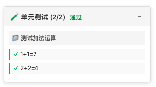
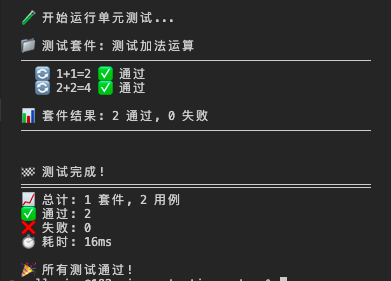
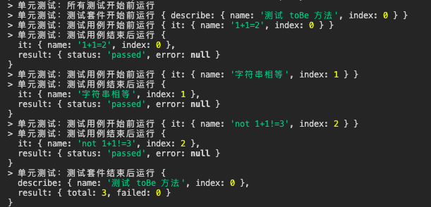
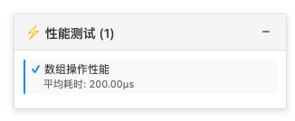
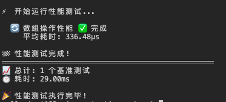
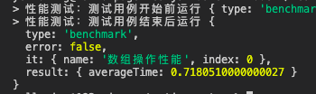
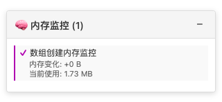
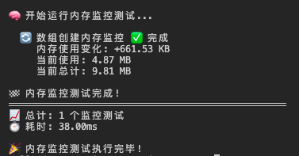
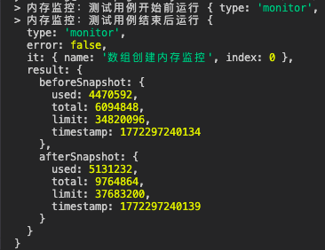

# [@oipage/testjs](https://github.com/oi-contrib/oipage-testjs)
可视化前端测试库，包括单元测试、性能测试、内存监控等，支持浏览器、Nodejs等环境

<p>
    <a href="https://zxl20070701.github.io/toolbox/#/npm-download?packages=@oipage/testjs&interval=7">
        
    </a>
    <a href="https://www.npmjs.com/package/@oipage/testjs">
        
    </a>
    <a href="https://github.com/oi-contrib/oipage-testjs/issues">
        
    </a>
    <a href="https://github.com/oi-contrib/oipage-testjs" target='_blank'>
        
    </a>
    <a href="https://github.com/oi-contrib/oipage-testjs">
        
    </a>
     <a href="https://gitee.com/oi-contrib/oipage-testjs" target='_blank'>
        
    </a>
    <a href="https://gitee.com/oi-contrib/oipage-testjs">
        
    </a>
</p>


## 如何使用？

首先，需要安装：

```
npm install --save @oipage/testjs
```

然后就可以使用了，我们提供了不同的测试单元供你选择，详细的API文档和使用指南请参考以下文档：

- [单元测试](docs/unit.md) - 提供单元测试功能，可以分类分组统计API是否正确
- [性能测试](docs/performance.md) - 提供性能基准测试功能，可以测量代码执行时间和性能指标
- [内存监控](docs/memory.md) - 提供内存使用情况监控，可以检测内存泄漏和内存使用模式

## 运行效果

### 单元测试界面
<table>
    <tr>
        <td>浏览器端</td>
        <td>Node.js</td>
        <td>高级用法</td>
    </tr>
    <tr>
        <td>
            
        </td>
        <td>
           
        </td>
        <td>
           
        </td>
    </tr>
</table>

### 性能测试界面
<table>
    <tr>
        <td>浏览器端</td>
        <td>Node.js</td>
        <td>高级用法</td>
    </tr>
    <tr>
        <td>
            
        </td>
        <td>
           
        </td>
        <td>
           
        </td>
    </tr>
</table>

### 内存监控界面
<table>
    <tr>
        <td>浏览器端</td>
        <td>Node.js</td>
        <td>高级用法</td>
    </tr>
    <tr>
        <td>
            
        </td>
        <td>
           
        </td>
        <td>
           
        </td>
    </tr>
</table>

## 版权

MIT License

Copyright (c) [zxl20070701](https://zxl20070701.github.io/notebook/home.html) 走一步，再走一步